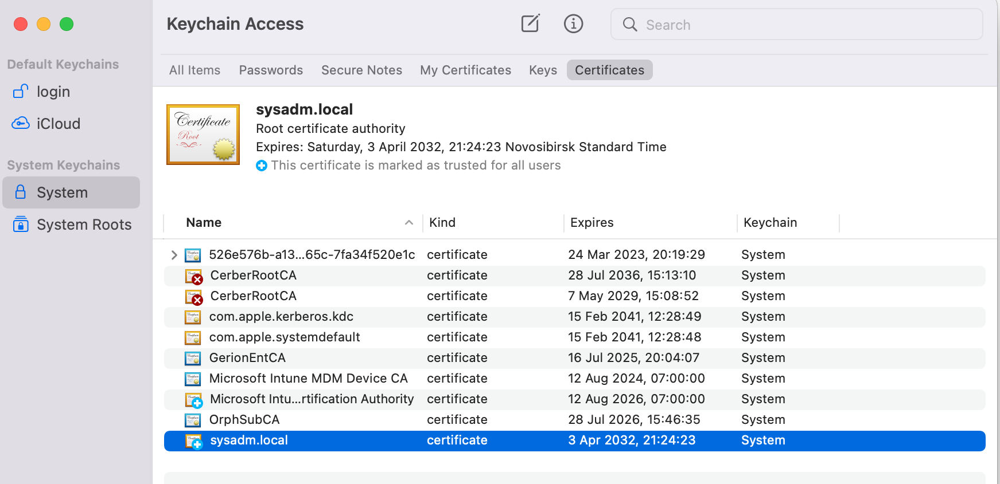
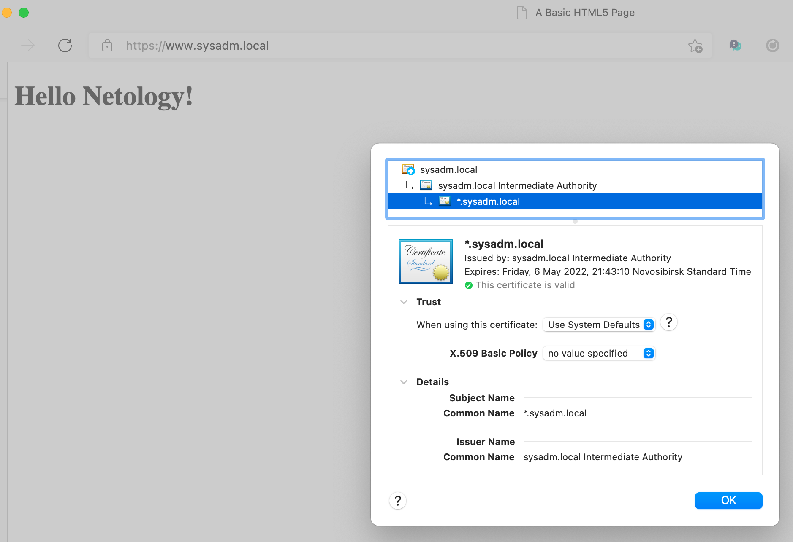
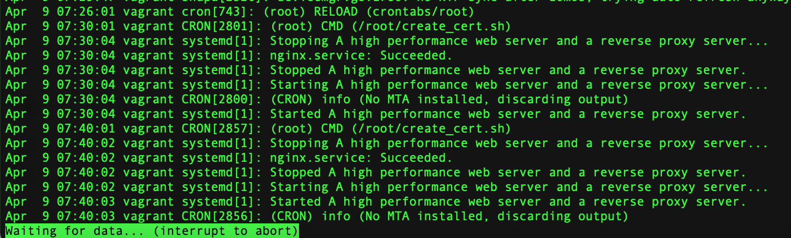
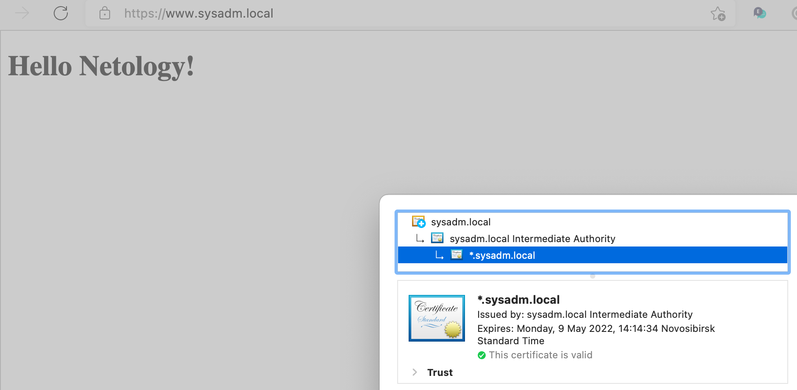
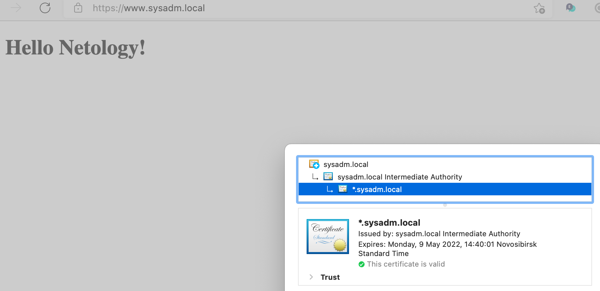

# Курсовая работа по итогам модуля "DevOps и системное администрирование"

Курсовая работа необходима для проверки практических навыков, полученных в ходе прохождения курса "DevOps и системное 
администрирование".

Мы создадим и настроим виртуальное рабочее место. Позже вы сможете использовать эту систему для выполнения домашних 
заданий по курсу

## Задание

1. Создайте виртуальную машину Linux.

Vagrant
```shell
# -*- mode: ruby -*-
# vi: set ft=ruby :

Vagrant.configure("2") do |config|
  config.vm.box = "bento/ubuntu-20.04"

  config.vm.synced_folder "./data", "/vagrant_data"
  config.vm.network "private_network", ip: "192.168.56.20"
  config.vm.network "forwarded_port", guest: 80, host:58080
  config.vm.network "forwarded_port", guest: 443, host:58443
  config.vm.provider "virtualbox" do |v|
    v.memory = 1524
    v.cpus = 3
  end
end
```

2. Установите ufw и разрешите к этой машине сессии на порты 22 и 443, при этом трафик на интерфейсе localhost (lo) 
должен ходить свободно на все порты.

```shell
vagrant@vagrant:~$ ip -br a
lo               UNKNOWN        127.0.0.1/8 ::1/128 
eth0             UP             10.0.2.15/24 fe80::a00:27ff:feb1:285d/64 
eth1             UP             192.168.56.20/24 fe80::a00:27ff:fe16:bb08/64 
```

Добавить установку ufw и настройку в секцию провижининга 
```shell
Vagrant.configure("2") do |config|
  config.vm.box = "bento/ubuntu-20.04"

...

  config.vm.provision "shell", inline: <<-SHELL
    apt-get update
    apt-get install -y ufw
    ufw allow in on eth0 to 10.0.2.15
    ufw allow in on eth1 to 192.168.56.20 port 22
    ufw allow in on eth1 to 192.168.56.20 port 443
    echo y | ufw enable

  SHELL
end
```

3. Установите hashicorp vault ([инструкция по ссылке](https://learn.hashicorp.com/tutorials/vault/getting-started-install?in=vault/getting-started#install-vault)).

Добавить установку пакета в секцию провижининга 
```shell
Vagrant.configure("2") do |config|
  config.vm.box = "bento/ubuntu-20.04"

...

  config.vm.provision "shell", inline: <<-SHELL
...
    curl -fsSL https://apt.releases.hashicorp.com/gpg | apt-key add -
    apt-add-repository "deb [arch=amd64] https://apt.releases.hashicorp.com $(lsb_release -cs) main"
    apt-get update && apt-get install vault jq
    vault server -dev -dev-root-token-id root
  SHELL
end
```

4. Создайте центр сертификации по инструкции ([ссылка](https://learn.hashicorp.com/tutorials/vault/pki-engine?in=vault/secrets-management)) и выпустите сертификат для использования его в настройке веб-сервера nginx (срок жизни сертификата - месяц).

Запустить vault в отдельной консоли
```shell
~# vault server -dev -dev-root-token-id root

==> Vault server configuration:

             Api Address: http://127.0.0.1:8200
                     Cgo: disabled
         Cluster Address: https://127.0.0.1:8201
              Go Version: go1.17.5
              Listener 1: tcp (addr: "127.0.0.1:8200", cluster address: "127.0.0.1:8201", max_request_duration: "1m30s", max_request_size: "33554432", tls: "disabled")
               Log Level: info
                   Mlock: supported: true, enabled: false
           Recovery Mode: false
                 Storage: inmem
                 Version: Vault v1.9.3
             Version Sha: 7dbdd57243a0d8d9d9e07cd01eb657369f8e1b8a
             
...

  WARNING! dev mode is enabled! In this mode, Vault runs entirely in-memory
and starts unsealed with a single unseal key. The root token is already
authenticated to the CLI, so you can immediately begin using Vault.

You may need to set the following environment variable:

    $ export VAULT_ADDR='http://127.0.0.1:8200'

The unseal key and root token are displayed below in case you want to
seal/unseal the Vault or re-authenticate.

Unseal Key: whKiqePnkVaqJEQy+Kj6BnZSW2RqKCf2AOtJCIINaVk=
Root Token: root

Development mode should NOT be used in production installations!
           
```

Настроить переменные окружения и политики
```shell
~# export VAULT_ADDR=http://127.0.0.1:8200
~# export VAULT_TOKEN=root

~# cat /track-files/track-policy.hcl
# Enable secrets engine
path "sys/mounts/*" {
  capabilities = [ "create", "read", "update", "delete", "list" ]
}

# List enabled secrets engine
path "sys/mounts" {
  capabilities = [ "read", "list" ]
}

# Work with pki secrets engine
path "pki*" {
  capabilities = [ "create", "read", "update", "delete", "list", "sudo" ]
}
```

**Сгенерировать Root CA**

```shell
~# vault secrets enable pki
Success! Enabled the pki secrets engine at: pki/
 
~# vault secrets tune -max-lease-ttl=87600h pki
Success! Tuned the secrets engine at: pki/
```
Сгенерировать корневой сертификат /track-files/CA_cert.crt.
```shell
~# vault write -field=certificate pki/root/generate/internal \
  common_name="sysadm.local" \
  ttl=87600h > /track-files/CA_cert.crt
```

Настроить CA и CRL URLы.
```shell
~# vault write pki/config/urls \
  issuing_certificates="http://127.0.0.1:8200/v1/pki/ca" \
  crl_distribution_points="http://127.0.0.1:8200/v1/pki/crl"
Success! Data written to: pki/config/urls
```

**Сгенерировать промежуточный CA**
```shell
~# vault secrets enable -path=pki_int pki
Success! Enabled the pki secrets engine at: pki_int/

~# vault secrets tune -max-lease-ttl=43800h pki_int
Success! Tuned the secrets engine at: pki_int/
```

Сгенерировать запрос на создание сертификата промежуточного CA (CSR)
```shell
~# vault write -format=json pki_int/intermediate/generate/internal \
        common_name="sysadm.local Intermediate Authority" \
        | jq -r '.data.csr' > /track-files/pki_intermediate.csr
```

Подписать запрос промежуточного CA корневым сертификатом
```shell
:~# vault write -format=json pki/root/sign-intermediate csr=@/track-files/pki_intermediate.csr \
        format=pem_bundle ttl="43800h" \
        | jq -r '.data.certificate' \
        > /track-files/intermediate.cert.pem
```

Импортировать сертификат в Vault.
```shell
~# vault write pki_int/intermediate/set-signed \
    certificate=@/track-files/intermediate.cert.pem
Success! Data written to: pki_int/intermediate/set-signed
```

**Создать сертификат для сайта**

```shell
~# vault write pki_int/roles/sysadm-dot-local \
  allowed_domains="sysadm.local" \
  allow_subdomains=true \
  max_ttl="720h"
Success! Data written to: pki_int/roles/sysadm-dot-local

vagrant ~# vault write -format=json pki_int/issue/sysadm-dot-local \
    common_name="*.sysadm.local" ttl="720h" \
    > /track-files/wildcard_sysadm-dot-local.json
```
Разложить полученный результат по файлам приватного ключа и сертификата
```shell
vagrant ~# cat /track-files/wildcard_sysadm-dot-local.json | 
 jq -r '.data.private_key' > /etc/nginx/www.sysadm.local.pem

vagrant ~# cat /track-files/wildcard_sysadm-dot-local.json | 
 jq -r '.data.certificate' > /etc/nginx/www.sysadm.local.crt

vagrant ~# cat /track-files/wildcard_sysadm-dot-local.json | 
 jq -r '.data.ca_chain[]' >> /etc/nginx/www.sysadm.local.crt
```

5. Установите корневой сертификат созданного центра сертификации в доверенные в хостовой системе.

Импортировать сертификат центра сертификации из CA_cert.crt в бразуер.


6. Установите nginx.

Добавить установку пакета в секцию провижининга 
```shell
Vagrant.configure("2") do |config|
  config.vm.box = "bento/ubuntu-20.04"

...

  config.vm.provision "shell", inline: <<-SHELL
...
    apt-get install -y nginx
    
    if [ ! -f /var/www/netology/index.html ]; then cp -r /vagrant_data/www/netology /var/www; fi
    if [ ! -f /etc/nginx/sites-available/netology ]; then cp /vagrant_data/nginx/netology /etc/nginx/sites-available; fi
    if [ -L /etc/nginx/sites-enabled/default ]; then /etc/nginx/sites-enabled/default; fi
    if [ ! -L /etc/nginx/sites-enabled/netology ]; then ln -s /etc/nginx/sites-available/netology /etc/nginx/sites-enabled; fi

    systemctl restart nginx

  SHELL
end
```

7. По инструкции ([ссылка](https://nginx.org/en/docs/http/configuring_https_servers.html)) настройте nginx на https, 
используя ранее подготовленный сертификат:
  - можно использовать стандартную стартовую страницу nginx для демонстрации работы сервера;
  - можно использовать и другой html файл, сделанный вами;

/var/www/netology/index.html 
```shell
<!doctype html>
<html lang="en">
<head>
  <meta charset="utf-8">
  <meta name="viewport" content="width=device-width, initial-scale=1">

  <title>A Basic HTML5 Page</title>
  <meta name="description" content="A simple HTML5 page">
  <meta name="author" content="K.Mankov">
</head>

<body>
	<h1> Hello Netology! </h1>
</body>
</html>

```

/etc/nginx/sites-available/netology
```shell
server {
    listen              10.0.2.15:80;
    listen              443 ssl;
    server_name         www.sysadm.local;
    ssl_certificate     "/etc/nginx/www.sysadm.local.crt";
    ssl_certificate_key "/etc/nginx/www.sysadm.local.pem";
    ssl_protocols       TLSv1.1 TLSv1.2;
    ssl_ciphers         HIGH:!aNULL:!MD5;
    
    location / {
        root /var/www/netology;
    }    
}

```

8. Откройте в браузере на хосте https адрес страницы, которую обслуживает сервер nginx.

```shell
$ cat /etc/hosts
##
# Host Database
#
# localhost is used to configure the loopback interface
# when the system is booting.  Do not change this entry.
##
127.0.0.1	localhost
255.255.255.255	broadcasthost
::1             localhost
192.168.56.20   www.sysadm.local

```



9. Создайте скрипт, который будет генерировать новый сертификат в vault:
  - генерируем новый сертификат так, чтобы не переписывать конфиг nginx;
  - перезапускаем nginx для применения нового сертификата.

/root/create_cert.sh
```shell
#!/usr/bin/env bash

export VAULT_ADDR=http://127.0.0.1:8200
export VAULT_TOKEN="$(cat /root/.vault-token)"

if vault status -ca-cert=/track-files/CA_cert.crt &>/dev/null; then
    vault write pki_int/revoke \
        serial_number="$(cat /track-files/wildcard_sysadm-dot-local.json | jq -r '.data.serial_number')"
    
    vault write -format=json \
        pki_int/issue/sysadm-dot-local \
        common_name="*.sysadm.local" ttl="720h" \
        > /track-files/wildcard_sysadm-dot-local.json
    
    cat /track-files/wildcard_sysadm-dot-local.json | 
     jq -r '.data.private_key' > /etc/nginx/www.sysadm.local.pem
    
    cat /track-files/wildcard_sysadm-dot-local.json | 
     jq -r '.data.certificate' > /etc/nginx/www.sysadm.local.crt
    
    cat /track-files/wildcard_sysadm-dot-local.json | 
     jq -r '.data.ca_chain[]' >> /etc/nginx/www.sysadm.local.crt
    
    systemctl restart nginx.service
else
    echo "Vault is sealed or service does not available"
fi
```

10. Поместите скрипт в crontab, чтобы сертификат обновлялся какого-то числа каждого месяца в удобное для вас время.

```shell
vagrant ~# crontab -e
vagrant ~# crontab -l
*/10 * * * * /root/create_cert.sh 
```









## Итоговый скрипт разворачивания ВМ

```shell
# -*- mode: ruby -*-
# vi: set ft=ruby :

Vagrant.configure("2") do |config|
  config.vm.box = "bento/ubuntu-20.04"

  # config.vm.network "forwarded_port", guest: 80, host: 8080
  # config.vm.network "forwarded_port", guest: 80, host: 8080, host_ip: "127.0.0.1"
  config.vm.network "private_network", ip: "192.168.56.20"
  # config.vm.network "public_network"
  config.vm.synced_folder "data/", "/vagrant_data"
  # config.vm.network "forwarded_port", guest: 19999, host: 19999
  # config.vm.network "forwarded_port", guest: 9100, host: 9100
  config.vm.network "forwarded_port", guest: 80, host:58080
  config.vm.network "forwarded_port", guest: 443, host:58443
  config.vm.provider "virtualbox" do |v|
    v.memory = 1524
    v.cpus = 3
  end

  config.vm.provision "shell", inline: <<-SHELL
    apt-get update
    apt-get install -y ufw nginx unzip

    ufw allow in on eth0 to 10.0.2.15
    ufw allow in on eth1 to 192.168.56.20 port 22
    ufw allow in on eth1 to 192.168.56.20 port 80
    ufw allow in on eth1 to 192.168.56.20 port 443
    echo y | ufw enable

    unzip /vagrant_data/vault_1.9.3_linux_amd64.zip -d /usr/bin
    chmod 700 /usr/bin/vault

    vault server -dev -dev-root-token-id root &
    sleep 15

    echo root > /root/.vault-token
    chmod 400 /root/.vault-token

    /vagrant_data/setup_vault.sh

    if [ ! -f /var/www/netology/index.html ]; then cp -r /vagrant_data/www/netology /var/www; fi
    if [ ! -f /etc/nginx/sites-available/netology ]; then cp /vagrant_data/nginx/netology /etc/nginx/sites-available; fi
    if [ -L /etc/nginx/sites-enabled/default ]; then /etc/nginx/sites-enabled/default; fi
    if [ ! -L /etc/nginx/sites-enabled/netology ]; then ln -s /etc/nginx/sites-available/netology /etc/nginx/sites-enabled; fi

    systemctl restart nginx
    
    cp /vagrant_data/create_cert.sh /root
    chmod 700 /root/create_cert.sh
    if [[ $(grep -c "create_cert.sh") -eq 0 ]]; then
      echo "*/10 * * * * /root/create_cert.sh" >> /var/spool/cron/crontabs/root
    fi
    
  SHELL
end

```

/vagrant_data/setup_vault.sh
```shell
#!/usr/bin/env bash

export VAULT_ADDR=http://127.0.0.1:8200
export VAULT_TOKEN="$(cat /root/.vault-token)"

cat << 'EOF' > /track-files/track-policy.hcl
# Enable secrets engine
path "sys/mounts/*" {
  capabilities = [ "create", "read", "update", "delete", "list" ]
}

# List enabled secrets engine
path "sys/mounts" {
  capabilities = [ "read", "list" ]
}

# Work with pki secrets engine
path "pki*" {
  capabilities = [ "create", "read", "update", "delete", "list", "sudo" ]
}
EOF

vault secrets enable pki
vault secrets tune -max-lease-ttl=87600h pki

vault write -field=certificate pki/root/generate/internal \
  common_name="sysadm.local" \
  ttl=87600h > /track-files/CA_cert.crt

vault write pki/config/urls \
  issuing_certificates="http://127.0.0.1:8200/v1/pki/ca" \
  crl_distribution_points="http://127.0.0.1:8200/v1/pki/crl"

vault secrets enable -path=pki_int pki

vault secrets tune -max-lease-ttl=43800h pki_int

vault write -format=json pki_int/intermediate/generate/internal \
  common_name="sysadm.local Intermediate Authority" \
  | jq -r '.data.csr' > /track-files/pki_intermediate.csr

vault write -format=json pki/root/sign-intermediate csr=@/track-files/pki_intermediate.csr \
  format=pem_bundle ttl="43800h" \
  | jq -r '.data.certificate' \
  > /track-files/intermediate.cert.pem

vault write pki_int/intermediate/set-signed \
  certificate=@/track-files/intermediate.cert.pem

vault write pki_int/roles/sysadm-dot-local \
  allowed_domains="sysadm.local" \
  allow_subdomains=true \
  max_ttl="720h"

vault write -format=json pki_int/issue/sysadm-dot-local \
    common_name="*.sysadm.local" ttl="720h" \
    > /track-files/wildcard_sysadm-dot-local.json

cat /track-files/wildcard_sysadm-dot-local.json |
 jq -r '.data.private_key' > /etc/nginx/www.sysadm.local.pem

cat /track-files/wildcard_sysadm-dot-local.json |
 jq -r '.data.certificate' > /etc/nginx/www.sysadm.local.crt

cat /track-files/wildcard_sysadm-dot-local.json |
 jq -r '.data.ca_chain[]' >> /etc/nginx/www.sysadm.local.crt

cp /track-files/CA_cert.crt /vagrant_data
```

## Результат

Результатом курсовой работы должны быть снимки экрана или текст:

- Процесс установки и настройки ufw
- Процесс установки и выпуска сертификата с помощью hashicorp vault
- Процесс установки и настройки сервера nginx
- Страница сервера nginx в браузере хоста не содержит предупреждений 
- Скрипт генерации нового сертификата работает (сертификат сервера nginx должен быть "зеленым")
- Crontab работает (выберите число и время так, чтобы показать, что crontab запускается и делает что надо)

## Как сдавать курсовую работу

Курсовую работу выполните в файле readme.md в github репозитории. В личном кабинете отправьте на проверку ссылку на .md-файл в вашем репозитории.

Также вы можете выполнить задание в [Google Docs](https://docs.google.com/document/u/0/?tgif=d) и отправить в личном кабинете на проверку ссылку на ваш документ.
Если необходимо прикрепить дополнительные ссылки, просто добавьте их в свой Google Docs.

Перед тем как выслать ссылку, убедитесь, что ее содержимое не является приватным (открыто на комментирование всем, у кого есть ссылка), иначе преподаватель не сможет проверить работу. 
Ссылка на инструкцию [Как предоставить доступ к файлам и папкам на Google Диске](https://support.google.com/docs/answer/2494822?hl=ru&co=GENIE.Platform%3DDesktop).
